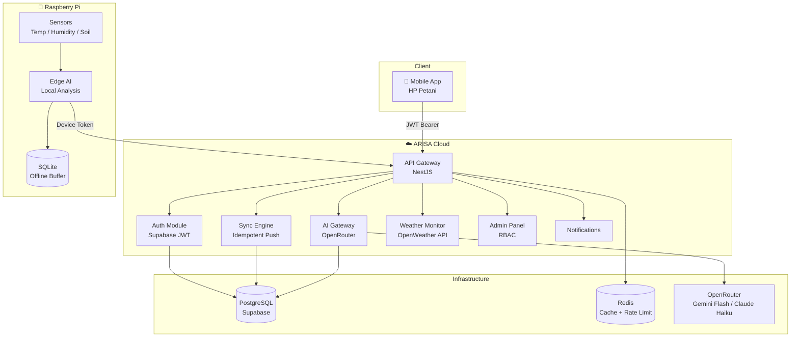
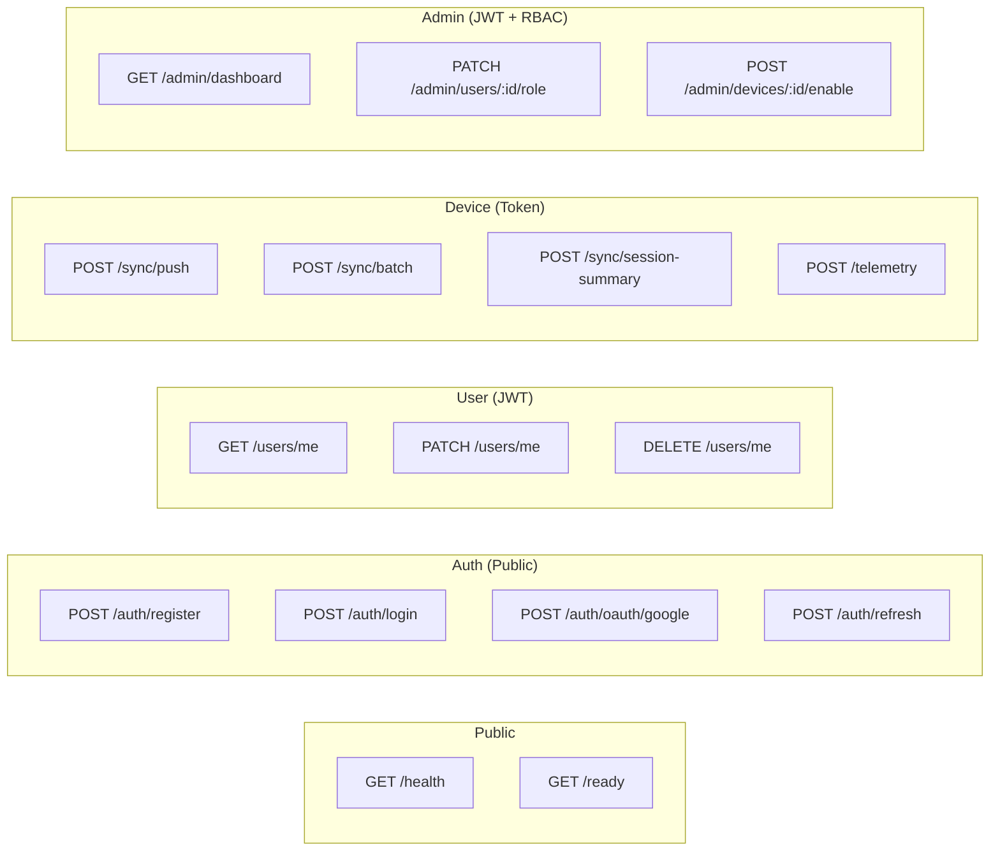
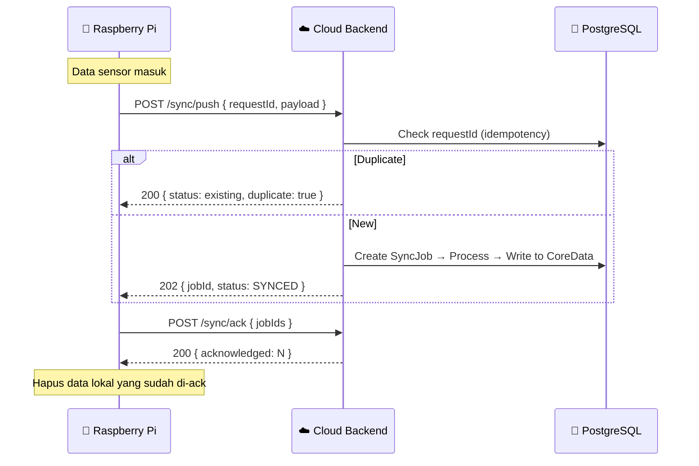
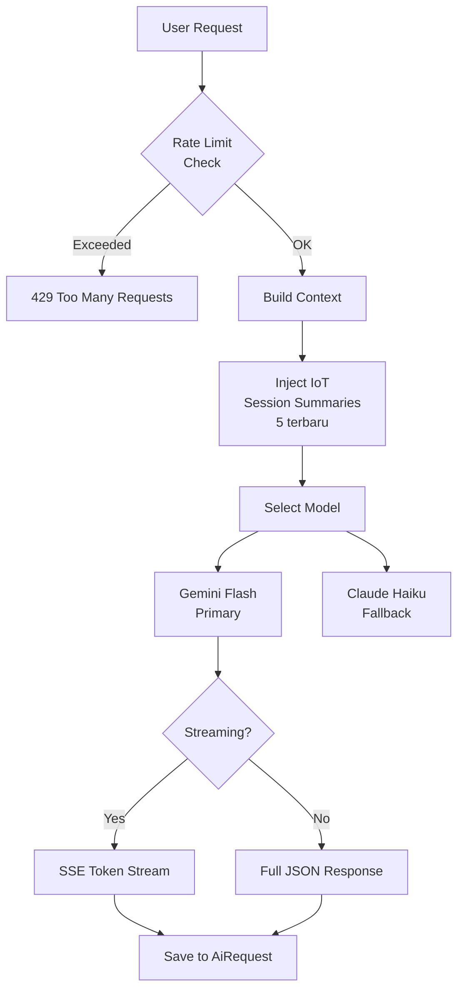
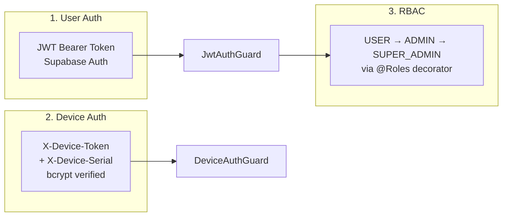

<p align="center">
  
  
  
  
  
  
  
</p>

# ARISA Cloud Backend

Cloud backend untuk ARISA — sistem pertanian cerdas berbasis IoT yang menghubungkan Raspberry Pi di lapangan dengan aplikasi petani.

Backend ini jadi pusat dari semuanya: identitas user, pairing perangkat, sinkronisasi data edge-to-cloud, AI analysis, dan monitoring. Dibangun pakai NestJS sebagai modular monolith karena di tahap ini microservices itu overkill — tapi strukturnya sudah dipisah per domain supaya gampang di-extract kalau nanti butuh.

## Table of Contents

- [Architecture](#architecture)
- [Tech Stack](#tech-stack)
- [Quick Start](#quick-start)
- [Project Structure](#project-structure)
- [API Overview](#api-overview)
- [Sync Engine](#sync-engine)
- [AI Gateway](#ai-gateway)
- [Session Summaries (IoT → AI)](#session-summaries-iot--ai)
- [Security Model](#security-model)
- [Environment Variables](#environment-variables)
- [Deployment](#deployment)
- [Documentation Index](#documentation-index)
- [Current Status](#current-status)
- [Developer Context](#developer-context)

---

## Architecture

Tiga entitas yang saling terhubung:



### 3 Mode Operasi

Sistem ini didesain untuk kondisi internet yang tidak stabil di area pertanian:

| Mode | Kondisi | Behavior |
|------|---------|----------|
| **Online-Online** | App + Pi + Cloud terhubung | Data langsung masuk ke cloud |
| **Offline-Online** | User nggak ada internet, Pi tetap jalan | Pi buffer data di SQLite, sync saat koneksi balik |
| **Offline-Offline** | Semua mati | Pi pakai credential cache. Sync nanti kalau sudah online |

Prinsip utama: **cloud = sumber kebenaran final.** Pi itu cuma buffer. Tidak boleh ada identitas baru yang lahir tanpa persetujuan cloud.

---

## Tech Stack

| Layer | Technology | Kenapa dipilih |
|-------|-----------|----------------|
| Framework | **NestJS 11** | Dependency injection, modular, TypeScript native |
| ORM | **Prisma 7** | Type-safe queries, driver adapter (`@prisma/adapter-pg`) |
| Database | **PostgreSQL 15** | Via Supabase (managed), PgBouncer connection pooling |
| Auth | **Supabase Auth** | JWT, OAuth Google, session management out of the box |
| Cache | **Redis 7** | Rate limiting, caching. **Opsional** — fallback ke in-memory |
| AI | **OpenRouter** | Gateway ke Gemini Flash (default) + Claude Haiku (fallback) |
| Security | **Helmet + Throttler** | HTTP headers hardening + global rate limiting |
| Docs | **Swagger/OpenAPI** | Auto-generated dari decorators |
| Container | **Docker** | Multi-stage build, non-root user |

---

## Quick Start

```bash
# 1. Clone & install
git clone <repo-url>
cd back_end
npm install

# 2. Setup environment
cp .env.example .env
# isi: DATABASE_URL, SUPABASE_URL, SUPABASE_ANON_KEY, 
#      SUPABASE_SERVICE_ROLE_KEY, OPENROUTER_API_KEY, 
#      DEVICE_REGISTRATION_SECRET

# 3. Database
npx prisma generate
npx prisma migrate dev --name init

# 4. Run
npm run start:dev
```

Swagger: **http://localhost:3000/api/docs**
Health: **http://localhost:3000/health**

Kalau mau PostgreSQL + Redis lokal tanpa install manual:

```bash
docker compose up -d     # PostgreSQL 15 + Redis 7
```

---

## Project Structure

```
src/
├── common/
│   ├── config/           # Env validation, configuration factory
│   ├── constants/        # Error codes, error messages (ID), roles
│   ├── decorators/       # @CurrentUser, @CurrentDevice, @Public, @Roles
│   ├── filters/          # Global exception filter (consistent error format)
│   ├── guards/           # JwtAuthGuard, DeviceAuthGuard, RolesGuard
│   ├── interceptors/     # Transform response + request logging
│   └── middleware/        # Request ID injection (X-Request-Id)
├── modules/
│   ├── admin/            # Dashboard stats, user/device management
│   ├── ai-gateway/       # Chat, streaming, structured analysis
│   ├── audit/            # Audit trail logging + query
│   ├── auth/             # Register, login, OAuth, refresh, logout
│   ├── data/             # Core data CRUD with ownership
│   ├── device/           # Register, pairing, heartbeat, revoke
│   ├── health/           # Liveness + readiness probes
│   ├── notification/     # In-app notifications
│   ├── sync/             # Push, batch, ack, pull, session-summary
│   ├── telemetry/        # Device hardware metrics
│   ├── user/             # Profile management + delete account
│   └── weather/          # Cuaca monitoring + rekomendasi pertanian
├── prisma/               # PrismaService with pg Pool adapter
├── redis/                # RedisService with graceful fallback
└── supabase/             # Public + Admin client wrappers
```

---

## API Overview

Semua endpoint di-prefix `/api/v1/` kecuali health checks.



### Full Endpoint Table

<details>
<summary><strong>Klik untuk lihat semua 48 endpoints</strong></summary>

| Method | Path | Auth | Description |
|--------|------|------|-------------|
| **Auth** ||||
| `POST` | `/auth/register` | Public | Register dengan email + password |
| `POST` | `/auth/login` | Public | Login, return JWT |
| `POST` | `/auth/oauth/google` | Public | OAuth Google |
| `POST` | `/auth/refresh` | Public | Refresh access token |
| `POST` | `/auth/logout` | JWT | Logout (invalidate session) |
| `POST` | `/auth/revoke-all` | JWT | Revoke semua sesi |
| **Users** ||||
| `GET` | `/users/me` | JWT | Get profile |
| `PATCH` | `/users/me` | JWT | Update profile |
| `DELETE` | `/users/me` | JWT | Soft delete account |
| **Devices** ||||
| `POST` | `/devices/register` | Secret | Register device baru |
| `POST` | `/devices/pair/start` | JWT | Mulai pairing (generate code) |
| `POST` | `/devices/pair/confirm` | JWT | Konfirmasi pairing code |
| `GET` | `/devices` | JWT | List devices milik user |
| `GET` | `/devices/:id` | JWT | Detail device |
| `POST` | `/devices/:id/revoke` | JWT | Cabut pairing |
| `POST` | `/devices/:id/heartbeat` | Device Token | Heartbeat dari Pi |
| **Sync** ||||
| `POST` | `/sync/push` | Device Token | Push satu item |
| `POST` | `/sync/batch` | Device Token | Push batch (max 100) |
| `GET` | `/sync/status/:jobId` | Device Token | Cek status job |
| `POST` | `/sync/ack` | Device Token | Acknowledge synced items |
| `GET` | `/sync/pull` | Device Token | Pull updates dari cloud |
| `POST` | `/sync/session-summary` | Device Token | Push edge AI summary |
| **Data** ||||
| `POST` | `/data` | JWT | Create data record |
| `GET` | `/data` | JWT | List data (paginated) |
| `GET` | `/data/:id` | JWT | Get satu record |
| `PATCH` | `/data/:id` | JWT | Update record |
| `DELETE` | `/data/:id` | JWT | Delete record |
| **Telemetry** ||||
| `POST` | `/telemetry` | Device Token | Push hardware metrics |
| `GET` | `/telemetry/device/:id` | JWT | Riwayat telemetry |
| **AI Gateway** ||||
| `POST` | `/ai/chat` | JWT | Chat (full response) |
| `POST` | `/ai/chat-stream` | JWT | Chat streaming (SSE) |
| `POST` | `/ai/analyze` | JWT | Structured JSON analysis |
| `GET` | `/ai/history` | JWT | Riwayat AI requests |
| **Notifications** ||||
| `GET` | `/notifications` | JWT | List + unread count |
| `PATCH` | `/notifications/:id/read` | JWT | Mark as read |
| `PATCH` | `/notifications/read-all` | JWT | Mark all as read |
| **Cuaca (Weather)** ||||
| `GET` | `/cuaca` | JWT | Cuaca + prakiraan + rekomendasi (by sawah_id or lat/lon) |
| **Sawah** ||||
| `POST` | `/sawah` | JWT | Daftarkan lokasi sawah baru |
| `GET` | `/sawah` | JWT | List semua sawah milik user |
| `GET` | `/sawah/:id` | JWT | Detail sawah (ownership check) |
| `PATCH` | `/sawah/:id` | JWT | Update data sawah |
| `DELETE` | `/sawah/:id` | JWT | Hapus sawah |
| **Admin** ||||
| `GET` | `/admin/dashboard` | RBAC | Stats (users, devices, AI, sessions) |
| `GET` | `/admin/users` | RBAC | List all users |
| `GET` | `/admin/devices` | RBAC | List all devices |
| `GET` | `/admin/sync-jobs` | RBAC | List sync jobs |
| `GET` | `/admin/logs` | RBAC | Query audit logs |
| `GET` | `/admin/sessions` | RBAC | List session summaries |
| `POST` | `/admin/devices/:id/disable` | RBAC | Disable device |
| `POST` | `/admin/devices/:id/enable` | RBAC | Re-enable device |
| `PATCH` | `/admin/users/:id/role` | SUPER_ADMIN | Change user role |
| `PATCH` | `/admin/users/:id/status` | RBAC | Suspend/activate user |
| **Health** ||||
| `GET` | `/health` | Public | Liveness probe |
| `GET` | `/ready` | Public | Readiness (DB + Redis + Supabase) |

</details>

---

## Sync Engine

Ini bagian paling kritis di seluruh sistem. Alurnya:



### Offline Recovery

Kalau Pi offline berhari-hari, data ditampung di SQLite lokal. Begitu internet balik:

1. Pi kumpulkan semua `pending_sync` records
2. Kirim via `POST /sync/batch` (max 100 per batch)
3. Cloud deduplikasi otomatis pakai `requestId` (UNIQUE constraint)
4. Duplicate = skip, baru = proses
5. Pi polling status → ack → hapus lokal

### Conflict Resolution

Pakai **Last Write Wins (LWW)** berdasarkan version number. Kalau cloud punya version lebih tinggi, data cloud menang. Detail lengkap ada di [`docs/SYNC-ENGINE.md`](./docs/SYNC-ENGINE.md).

---

## AI Gateway

Bukan cuma proxy ke OpenRouter. Ada beberapa mekanisme penting:



- **Rate limiting** — Per user, per menit dan per jam. Pakai Redis kalau ada, in-memory kalau nggak.
- **Model fallback** — Kalau Gemini Flash gagal, otomatis retry pakai Claude Haiku.
- **Streaming (SSE)** — `POST /ai/chat-stream` kirim token satu-satu via Server-Sent Events.
- **Structured analysis** — `POST /ai/analyze` return JSON terstruktur. Ada response healing kalau JSON-nya rusak.
- **IoT context injection** — 5 session summary terakhir otomatis masuk ke system prompt.
- **Web search** — Pakai OpenRouter server tool `openrouter:web_search`.

---

## Session Summaries (IoT → AI)

Ini fitur yang menghubungkan edge AI di Pi dengan cloud AI. Tanpa ini, AI chat cuma jawab generik.

```
Pi jalankan edge AI
  → Buat ringkasan sesi (suhu, kelembapan, alert, rekomendasi)
  → POST /sync/session-summary
  → Cloud simpan di tabel SessionSummary
  → User chat AI dengan deviceId
  → AI Gateway ambil 5 sesi terakhir
  → Injeksi ke system prompt
  → AI jawab: "suhu lahan Anda 35°C dalam 2 jam terakhir, 
     pertimbangkan irigasi tambahan"
```

---

## Security Model

Tiga layer autentikasi yang berbeda untuk tiga jenis client:



Error response selalu konsisten:

```json
{
  "success": false,
  "error": {
    "code": "AUTH_INVALID_CREDENTIALS",
    "message": "Email or password is incorrect",
    "userMessage": "Email atau password salah",
    "statusCode": 401
  },
  "meta": { "requestId": "...", "timestamp": "..." }
}
```

`userMessage` dalam Bahasa Indonesia — karena end user-nya petani.

---

## Environment Variables

<details>
<summary><strong>Klik untuk lihat semua environment variables</strong></summary>

### Wajib

| Variable | Keterangan |
|----------|------------|
| `DATABASE_URL` | Connection string PostgreSQL (pakai pooler port 6543 untuk Supabase) |
| `DIRECT_URL` | Direct connection untuk `prisma migrate` (port 5432, bukan pooler) |
| `SUPABASE_URL` | URL project Supabase |
| `SUPABASE_ANON_KEY` | Public key |
| `SUPABASE_SERVICE_ROLE_KEY` | Admin key (bypass RLS) |
| `SUPABASE_JWT_SECRET` | Untuk verifikasi JWT |
| `OPENROUTER_API_KEY` | API key OpenRouter |
| `DEVICE_REGISTRATION_SECRET` | Secret untuk registrasi device (min 20 karakter) |

### Opsional (ada default)

| Variable | Default | Keterangan |
|----------|---------|------------|
| `PORT` | `3000` | Port server |
| `NODE_ENV` | `development` | Environment |
| `REDIS_HOST` | `localhost` | Kalau nggak ada Redis, rate limit fallback ke in-memory |
| `REDIS_PORT` | `6379` | Port Redis |
| `CORS_ORIGINS` | `''` | Comma-separated domain untuk production |
| `THROTTLE_TTL` | `60` | Window rate limit (detik) |
| `THROTTLE_LIMIT` | `100` | Max request per window |
| `OPENROUTER_DEFAULT_MODEL` | `google/gemini-2.5-flash` | Model AI utama |
| `OPENROUTER_FALLBACK_MODEL` | `anthropic/claude-haiku-4.5` | Fallback |
| `OPENROUTER_MAX_TOKENS` | `8192` | Hard cap token output |
| `OPENROUTER_TIMEOUT_MS` | `30000` | Timeout per request |
| `AI_USER_RATE_LIMIT_PER_MINUTE` | `10` | AI rate limit per menit per user |
| `AI_USER_RATE_LIMIT_PER_HOUR` | `100` | AI rate limit per jam per user |
| `OPENWEATHER_API_KEY` | `''` | API key OpenWeather (daftar gratis di openweathermap.org) |
| `OPENWEATHER_CACHE_TTL_MINUTES` | `15` | Cache cuaca dalam menit |

Semua ada di [`.env.example`](./.env.example).

</details>

---

## Deployment

### Railway (Rekomendasi)

1. Connect repo ke Railway
2. Set semua environment variables
3. Railway auto-detect → `npm run build` → `node dist/main`
4. `postinstall` di package.json otomatis run `prisma generate`
5. Jalankan `npx prisma migrate deploy` via Railway shell

### Docker

```bash
docker build -t arisa-backend .
docker run -p 3000:3000 --env-file .env arisa-backend
```

Dockerfile pakai multi-stage build dan jalan sebagai non-root user `arisa`.

---

## Documentation Index

### Architecture & Design

| Dokumen | Isi |
|---------|-----|
| [`GETTING-STARTED.md`](./docs/GETTING-STARTED.md) | Setup lengkap dari nol |
| [`SYSTEM-OVERVIEW.md`](./docs/SYSTEM-OVERVIEW.md) | Gambaran besar, 3 mode operasi |
| [`ARCHITECTURE.md`](./docs/ARCHITECTURE.md) | Module map, layer architecture, data flow |
| [`ARCHITECTURE-DECISIONS.md`](./docs/ARCHITECTURE-DECISIONS.md) | ADR: kenapa X bukan Y |
| [`DATABASE-SCHEMA.md`](./docs/DATABASE-SCHEMA.md) | Prisma models, relasi, indexes |
| [`SYNC-ENGINE.md`](./docs/SYNC-ENGINE.md) | Idempotency, retry, conflict resolution |
| [`AUTH-SECURITY.md`](./docs/AUTH-SECURITY.md) | JWT flow, device token, RBAC |
| [`EDGE-RASPBERRY-PI.md`](./docs/EDGE-RASPBERRY-PI.md) | Setup Pi, SQLite, sync queue client |
| [`OBSERVABILITY.md`](./docs/OBSERVABILITY.md) | Logging, health, audit trail |
| [`BUILD-PHASES.md`](./docs/BUILD-PHASES.md) | Development checklist fase 0-4 |
| [`API-REFERENCE.md`](./docs/API-REFERENCE.md) | Endpoint reference lengkap |

### Frontend Integration Blueprints

Folder [`docs/implementation_front/`](./docs/implementation_front/) berisi 12 dokumen blueprint integrasi untuk tim frontend — setiap endpoint didokumentasikan dengan contoh request/response, error codes, dan catatan khusus.

---

## Current Status

Sistem ini sudah jalan dan terdokumentasi. Build clean, Swagger docs lengkap, 48 endpoints terimplementasi.

Yang sudah selesai:
- ✅ Auth (register, login, OAuth, refresh, logout, revoke-all)
- ✅ Device lifecycle (register → pair → heartbeat → revoke)
- ✅ Sync engine (push, batch, ack, pull, session-summary)
- ✅ AI gateway (chat, stream, analyze, history + IoT context)
- ✅ Weather monitoring (cuaca real-time, prakiraan 5 hari, rekomendasi pertanian)
- ✅ Sawah management (CRUD lokasi sawah + koordinat untuk cuaca)
- ✅ Admin management (dashboard, user/device management, audit logs)
- ✅ Rate limiting, CORS, Helmet, validation pipes
- ✅ Dockerfile + docker-compose

Yang belum:
- ⬜ Unit test coverage (saat ini cuma e2e boilerplate)
- ⬜ Auto-notification triggers (event-driven)
- ⬜ BullMQ untuk async sync processing (saat ini synchronous)
- ⬜ Push notification (FCM)
- ⬜ WebSocket untuk real-time device status

---

## Developer Context

> Bagian ini untuk AI assistant atau developer baru yang akan melanjutkan development.

8 hal yang harus dipahami sebelum menyentuh kode ini:

1. **Prisma pakai driver adapter** — `PrismaService` extends `PrismaClient` dengan `@prisma/adapter-pg` dan `pg` Pool langsung. Bukan Prisma default connection. `connectionTimeoutMillis: 5000` sudah diset manual karena pg Pool default-nya 0 (infinite). Lihat [`prisma.service.ts`](./src/prisma/prisma.service.ts).

2. **Redis itu opsional** — `RedisService` punya try-catch di constructor. Kalau connection gagal, sistem tetap jalan. Rate limiting di `ai-gateway.service.ts` juga punya in-memory fallback (`Map<string, ...>`). Jangan asumsikan Redis selalu tersedia.

3. **AI Gateway bukan proxy biasa** — Ada 5 layer: rate limiting → IoT context injection → model selection → streaming/non-streaming → response healing. `buildIotContext()` ambil 5 `SessionSummary` terakhir dan inject ke system prompt. Baca [`ai-gateway.service.ts`](./src/modules/ai-gateway/ai-gateway.service.ts) sebelum modify.

4. **Sync saat ini synchronous** — `processJob()` dipanggil inline di `push()` (line 53 di [`sync.service.ts`](./src/modules/sync/sync.service.ts)). Rencana awalnya pakai BullMQ queue, tapi karena Redis opsional, untuk sekarang diproses langsung. BullMQ bisa ditambahkan tanpa breaking change — tinggal pindahkan `processJob()` ke worker.

5. **Device auth pakai 2 header** — `X-Device-Token` (raw token, di-compare via bcrypt terhadap `tokenHash` di DB) dan `X-Device-Serial` (lookup device). Lihat [`device-auth.guard.ts`](./src/common/guards/device-auth.guard.ts). Guard juga update `lastSeenAt` secara fire-and-forget.

6. **Error messages bilingual** — Setiap `ErrorCode` punya `message` (English, teknikal) dan `userMessage` (Indonesia, untuk ditampilin ke petani). Source of truth: [`error-messages.ts`](./src/common/constants/error-messages.ts). `HttpExceptionFilter` otomatis attach `userMessage` ke response.

7. **Session summaries = jembatan IoT-AI** — Tanpa data di tabel `SessionSummary`, fungsi `buildIotContext()` return string kosong dan AI jawab tanpa konteks pertanian. Endpoint `POST /sync/session-summary` harus dipanggil secara periodik oleh Pi.

8. **Weather module = dual-layer cache** — `WeatherService` pakai Redis (15 min TTL) sebagai primary cache, dengan in-memory `Map` sebagai fallback kalau Redis mati. Koordinat di-round ke 2 desimal untuk cache key consistency. Rekomendasi pertanian di-generate oleh `WeatherRecommendationEngine` berdasarkan 10+ rules yang dikalibrasi untuk padi sawah tropis. OpenWeather free tier (Current + Forecast5) — bukan One Call 3.0 — karena nggak perlu bayar subscription terpisah.

---

```
npm run build   # harus 0 error
npm run lint    # harus clean
```

**Private — UNLICENSED**
